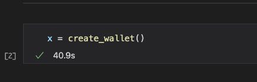
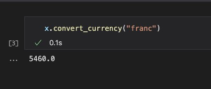

Currency Converter Wallet:

The Currency Converter Wallet is a simple, and efficient way of converting currency from  either  USD,  EUR,  GBP,  YEN  & FRANC to any of the 5 currencies previously listed. 

Project Motivation:
This project is inspired by my urge to travel and convert from my local currency which is USD  and fly away to another country without the worries of conversion rates and whether if I would lose money or gain.  With this package I made code that can convert my currency wallet amount to the currencies of my choosing to help better budget for my future trips and hopefully yours also.

Currency codes  currently installed in program:

USD		 United States Dollar
GBP		 United Kingdom Pound
EURO	 Euro Member Countries
YEN 	 Japan Yen
FRANC  	 Swiss Franc

First to start by running Currency_convertor.py
you must create a wallet. In example below the name the wallet x but it can be labeled any name the user may like. Answer the prompts displayed on the screen that follows.

To find convert currency in wallet in name_of_your_wallet.convert_currency(selected_currency)
example shown below:

